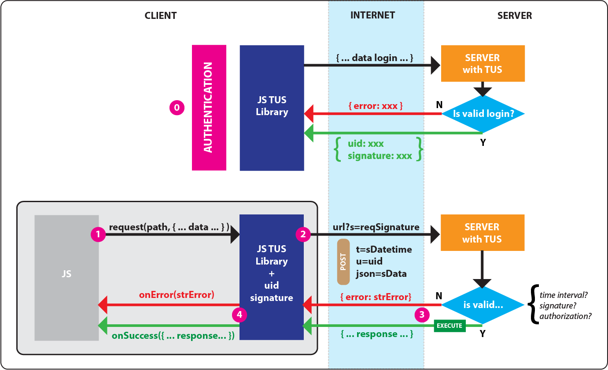

# TUS - Time User Signature

TUS is a client-server communication protocol that allows to
verify the validity of a user server call by signing the transmitted data
using a shared user "signature" token.

The implementation (javascript/python flask) makes it very easy
to manage client-server communication through the use of: 

* Javascript method
* Python wrapper/decorator
  
This implementation also allows restricting access to certain endpoints using roles.

Some implementation logics are intentionally abstract as they depend 
on the underlying architecture which cannot and should not be binding.

The use is very broad, however it is particularly useful in handling
calls to the methods of an API.

## CLIENT - JAVASCRIPT

The file "client/tuslib.js" defines two objects "tuslib" and "fun".

* "tuslib" contains the three main methods: login, logout and request.
* "fun" contains helper functions which should not be called directly.

The "request" method in "tuslib" delegates
the logics of signing requests once a user has logged in.

This interface allows making server calls in a very simple way
by passing as parameters:

- the path of the endpoint to call
- a dictionary of {properties: value} to sent to the server
- onSuccess function: callback executed on success that recives an object with
  data returned from the server
- onError function: callback executed if an error occurred, that receives a
  string with the description error.
  
## SERVER - PYTHON / FLASK

On the server side you just need the wrap a route function
with the "tus" function of the "server/tus.py" file

More information can be found in the files.